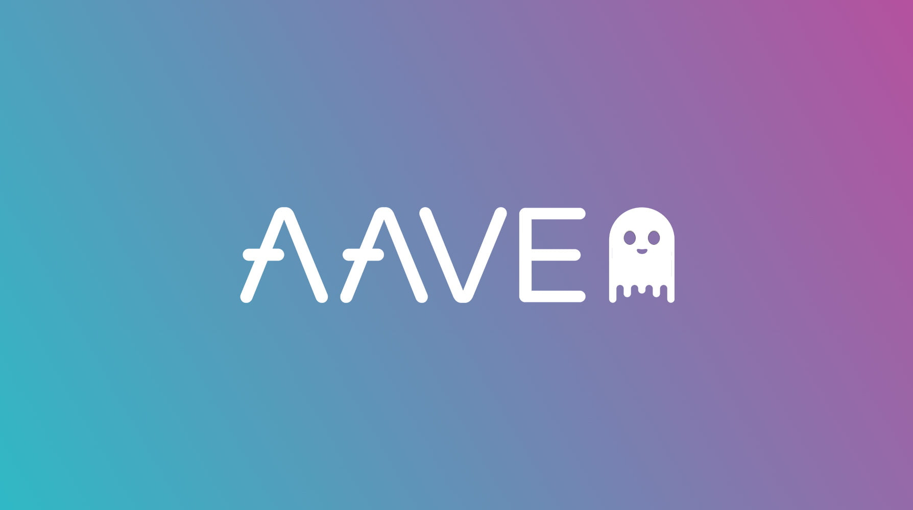

# Assignment 1 - Case Study (Aave)

## Overview and Origin

Aave is a private company founded in 2017 by Stani Kulechov under the name ETHLend. It began as a decentralized lending platform, rebranding itself as Aave in 2018, and has since expanded into other areas of decentralized finance.

The company has gone through 8 funding rounds beginning with an initial ICO raising of $US 16.5 on November 25th 2017 [[1]](https://coincentral.com/what-is-aave/). In total, Aave have raised $49M with the most recent funding round on February 4th, 2022 (https://www.crunchbase.com/organization/ethlend/company_financials). There are 6 lead investors in Aave: DTC Capital, Framework Ventures, Blockchain.com Ventures, Standard Crypto, Blockchain Capital and IBM (ibid.)

The company currently has 87 employees (https://pitchbook.com/profiles/company/224491-60#overview), although this number has likely changed in recent months. The CEO remains Stani Kulechov.The CFO is Peter Kerr and the CTO is Ernesto Boado

In an interview (https://blog.bitstamp.net/post/interview-with-aaves-founder-stani-kulechov/) Stani relates that the development of what is now Aave began as an interest in Ethereum that, coupled with his interest in finance, opened up for him possibilities of "reshaping the financial system" (.ibid).

---

## Business Activities

The basic framework of Aave is as a decentralised peer to peer lending and borrowing platform. What this means is that lenders and borrowers can interact with each other - borrow and lend - without the need for a trusted third party. What takes the place of this trusted intermediary is a smart contract. Aave is built on the Ethereum mainnet, and has since expanded to layer 2 chains. Aave allows for collateralized lending, more specifically overcollateralized lending. Put simply, the borrower puts up collateral as a guarantee. This collateral is locked and in return the borrower is able to receive a token. This allows the borrower to receive liquidity without selling their original tokens. This opens up short term liquidity that can be used for trading.

---

It can be hard to accurately calculate the market for Aave's product as it does not fall neatly into simple borrowing and lending, however, the global fintech lending market is projected to reach US$ 3100520 million by 2027 (https://reports.valuates.com/market-reports/QYRE-Auto-10R9175/global-fintech-lending). This is a growing market that is responding to the opaque and often needlessly complicated and inefficient traditional lending market. Aave is at the bleeding edge of this fintech movement, using blockchain technology and engaging with some of the leaders in the new web3 economy, both companies and individuals.

The intended market of Aave's borrowing and lending services is wide, ranging from first time borrowers/ lenders to institutional investors and fund managers. As a decentralised peer to peer platform with a well developed UI, Aave has and is appealing to small crypto traders and investors that have relatively low skill and capital. At them same time massive "hedge funds" like Celsius and 3AC utilise Aave to generate yield on their assets which allows them to offer products to the general public. As such, the potential market for Aave's services includes both small an large lending and borrowing, services usually dominated by banks.

Aave shares the 'unfair advantages' that many of the web3 fintech companies have. The borrowing and lenind services that Aave provide are 24/7, 365 days a year. The service is available to anyone with an internet connection and suffucient collateral, putting Aave in the digital age with the kind of immediate service the majority of people have come to expect. This level of convenience and accessibility puts it far ahead of most small to medium size ledning institutions.

Aave offers no lock in period on collateral provided. What this means is that someone lending to the protocol can withdraw their funds whenever they like. This level of liquidity is extremely advantageous as it allows anyone to have access to their collateral whenever they need it, enabling the movement of money in and out of Aave.

Aave has strong appeal to the current generation of 20 something's who have grown up on the web and are not just comfortable with digital services but who are often suspicious of traditional fonancial service providers. The very word "bank" has become tainted, synonymous with corruption and greed. Aave's brand, it's history, the people involved in building it are of this new generation and the comapny benefits from this image. Aave is not a bank, even though it might offer many of the services one would expect from a bank. Aave is a "defi" (decentralized finance) company.

Aave's decentralized peer to peer service is much more inclusionary than traditional borrowing and lending services. According to Mickinsey (https://www.mckinsey.com/industries/financial-services/our-insights/counting-the-worlds-unbanked), there are 2.5 billion adults worldwide who do not use traditional banks to save or borrow money. This is a market that traditional banks have been unable to access and it is doubtful that this will change anytime soon. Given the proliferation of internet connectedness, mobile phones, and the comfort with using web based services of any kind, Aave as a web native lending service is well positioned to access this market.

An interesting possible market for the future is commercial loans. A commercial loan is usually backed by some real estate (collateralized). As real estate tokenization becomes more mature, the possibility of Aave engaging in the commercial loan market is likely, opening up, at least, the unsecured part of the commercial lending market which is estimated to reach USD 29, 379.83 Billion in 2030 (https://www.prnewswire.com/news-releases/commercial-lending-market-size-to-reach-usd-29-379-83-billion-in-2030-at-a-cagr-of-13-1--valuates-reports-301469564.html). Some key market players/ competitors who are likely to be disrupted by Aave's growth are American Express, Credit Suisse, Goldman Sachs, and of course the major banks in any given country.

### Technology Used

Aave utilizes the Ethereum blockchain and it's smart contract framework to connect lenders with borrowers. Users post collateral to Aave and earn interest, with the rate of return dependent on the type of collateral they post. Aave is therefore acting as an intermediary, albeit a trustless one, facilitating the borrowing and lending of asssets between parties through the use of smart contracts. To give a scenario as an example, I deposit $100,000 worth of USDC into Aave. You, a financial institution, wanting to borrow a stableoin to then convert into fiat to facilitate an investment or perhaps a fiat loan, takes out a loan on Aave. In order to do so, this institution locks up some less liquid capital, say bitcoin.

So, in Aave what they have created is a liquidity pool. There are pools of different cryptocurrencies, all earning differing rates of interest. Aave does not custody these, and here is where the tech of the Ethereum blockchain and smart contracts come into play. Users deposit their assets into smart contracts. Now a borrower comes, accesses the pool they want, provides collateral to back their loan, and takes some of the assets from the pool.

But what if the borrower does not pay back their loan? Aave requires overcollateralization when facilitating these loans. For example, of I deposit 1 bitcoin worth $20,000 as my collateral, I may only be able ot borrow $10,000. There are is a liquidation point where if the value of the collateral I posted was to fall below, my position would be liquuidated and I would lose my bitcoin. This would then be used to pay back the lenders.

Smart contracts packaged into a decentralized application (dApp) and the lending market has changed fundamentally from what it was only 10 years ago. Regardless of credit history, employment status, race, country of origin, the use of smart contracts and blockchain tech enables trustless lending.

- While I am focusing on collateralized loans, Aave has and is making inroads into uncolateralized loans, essentially credit delegation. This is outside the scope of this case study however, as it involves the use of Aave's governance DAO in deciding the credit worthiness of potential borrowers, presents an exciting new opportunity and new frontier for decentralized lending.

## Landscape

Although Aave is involved in multiple fields and is expanding all the time, recently moving into social media, I would like to focus on the lending aspect of Aave's services. That is, collateralized lending.

One of the biggest trends in the lending space over the past decade is the increase in the number of non-bank lending institiutions. Especially for small to medium sized loans, one need only walk into any Westfield shopping center, or to type short term loan into a google search query and you will see a host of new companies. For businesses there is greater variety also, with big players like Amazon, Paypal and Apple getting into the market (https://www.gdslink.com/5-lending-trends-for-2021/).

With recent events making work online and at home more commonplace, there is less predisposition to go into a bank or place of business to take out a loan or buy a product. The very act of lending has become much more digital, much less located at a bank or office. Taking out a loan at your own home using a computer or smart phone is now accepted practice and people expect approval to be quick and automated. Perhaps that is at the heart of this trend - people often do not expect to have to talk to a person in order to get approval for a loan. The expectation now is immediate approval through an app and to have the money available then or very soon. Machine learning, big data, and the deepening digitization of money facilitate this process.

The other major comapnies in this domain in Australia are the big banks, of course, including Commonwealth Bank and National Australia Bank, but also personal loan providers such as Harmoney, Omm.

### Aave Competitors

Aave has plenty of entrenched competitors in the traditional finance space, banking institutions being the most common for small to medium sized lending. For home loans the big four banks in Australia are still the first institution most people think of when they are looking to borrow to buy a home. Aave is, as yet, not directly involved in this market, however this may change as crypto currencies become more acceptable forms of payment. For smaller personal loans there has been a massive increase in non bank lending institutions in Australia. The comparison websit "Finder.com" lists a few ot the larger ones (https://www.finder.com.au/personal-loans). There is also an increase in "buy now, pay later" services that essentially act as personal loan providers. These lenders exist in markets that Aave has not deliberately entered, however I feel they deserve mention as probable future competitors as crypto currency becomes more accepted and usable in other areas of the economy outside of finance.

Right now, it is really up to the user of Aave's services to decide how they spend their borrowed money, and there is the possibility, however difficult, that a loan from Aave could be used to buy a house, a car, a fridge, or a pack of chips. More likely, though, is that a loan from Aave will remain in the Ethereum or crypto currency ecosystem and be used in finance or to purchase digital products and services.

Perhaps the most relevant, and interesting, perspective on Aave's competitors is to focus on the crypto lending market. That is, to leave aside the traditional lending services and consider only those companies that deal with crypto currency lending.

The competitor that is most similar to Aave is Compound (https://compound.finance/) in that it is a decentralized organisation built on the Ethereum blockchain using smart contract technology. Two other major players in this field are Blockfi (https://blockfi.com/) and Nexo (https://nexo.io/). These two companines differ in that they are centralized organisations, much like any traditional financial institution, that utilize blockchains and smart contracts to deliver their products and services. Regardless, these two centralized lending institutions represent clear and strong competition to Aave.

Compund Finance (https://compound.finance/)

Nexo, according to it's website (https://nexo.io/) has $12b under management and a user base of 4 million worldwide. It is important to note that, as their website states, Nexo is available in 200+ jurisdictions. Not all jurisdictions. There is also a sign up process that involves divulging personal information as part of their "Know Your Customer" legal requirments. For some this may be an obstacle or drawback to the service. On the other hand, part of Nexo's attraction is it's centralised structure and the fact that this allows for insurance on assets held, a help desk that customers can contact, and a much more usual process of borrowing that most customers might be used to. Nexo also has no credit check, instead relying on the value of the crypto currency that is locked as collateral to garuntee the loan.

It is also interesting to note that recently Nexo backed it's first mortgage using crypto currency (https://www.foxbusiness.com/features/mighty-ducks-actor-brock-pierce-used-bitcoin-to-buy-1-2m-home-in-amsterdam) illustrating the probability of these crypto lending firms, both centralized and decentralized, entering the mortgage market.

Centralised lending institutions that use crypto, blockchains and smart contracts took a serious hit to their trustworthiness recently with the fall of centralised lender Celsius. Without going into too much detail, Celsius, a company much like Nexo in it's structure, mismanaged it's funds, took on too much leverage, all without any awareness from it's users. Ultimately, the assets under management by Celsius have been lost to it's users, at least in the short term. The case of Celsius highlights some of th eweaknesses of centralised lenders, namely a lack of transparency and the ability to arbitrarily and unilaterally freeze a users funds, deny withdrawals, and potentially steal through mismanagement.

---

## Results

One of the key metrics in the crypto currency space to measure the success of a dApp or protocol like Aave is token price and the "tokenomics" of that token. Aave's token, AAVE, is priced at US$72.45 with a market cap of $1,005,100,970.

According to aavewatch.com, total liquidity on Aave is $64,146,001.87.

Aave also collects fees from various sources within their lending and borrowing services. Flash loan fees prove to be the most lucrative with flash depositing fee earning $3,188,838.93 and flash protocol fee earning $1,366,645.00.

Aave collects about $50 million per year (https://www.protocol.com/fintech/aave-v3).

There have been some good figures as far as usage goes on the network, however, perhaps given the difficult macro climate and it's usual affect on lenders, Aave has seen a downturn in recent months. The number of addresses created on Aave, a good indicator of usage, has seen a %55 decline (https://ambcrypto.com/assessing-aaves-performance-after-protocol-launched-its-v3/). Transaction volume has also seen declines.

Social network following and traction are also often used as indicators of a protocol's health and future engagement. According to coingecko.com Aave currently has 473,913 followers (https://www.coingecko.com/en/coins/aave#social), growing steadily for the past year.

Aave has launched onto layer 2 scaling solutions that, once the impending Ethereum merge and move to proof of stake goes through, will likely dominate the space. With the advent of Aave v3, the protocol exists on Avalanche, Polygon, Fantom, Arbitrum, Optimism and Harmony. This will allow Aave to access more customers at lower costs.

---

## Recommendations

It is interesting to note that according to nestegg.com [[]](https://www.nestegg.com.au/borrow-money/loans/can-you-guess-australia-s-5th-largest-lender) "mom and dad" are Australia's 5th largest home loan provider! Parents are increasingly loaning money to their children in order for them to buy their first home. Aave is uniquely positioned to further facilitate this trend by providing the opportunity for parents to use their collateral, whether it is in the form of crypto currency or otherwise, to secure a loan. The more collateral Aave can accept the broader the market for it's services. Thus, I would recommend that Aave develop the functionality to accept collateral in the form of stocks and real estate. It is important to state that not all collateral should be accepted as this would dilute the strength of the protocol, but that stocks and real estate that is tokenized present solid collateral forms that will allow more borrowers to enter Aave's domain, especially the boomer generation.

In order for Aave to begin delivering this product at a large scale the technology around real estate tokenization needs to be mature and robust. As yet, this does not seem to be the case. Real estate tokenization is essentially representing ownership of real estate, whether total or fractional, on the blockchain. This field is relatively under developed and would need considerable investment and time to make the tech viable and trusted for the regular real estate holder/ investor.

One of the most attractive features of Aave's competitor Nexo is it's provision of a credit card, partnering with Mastercard. The Nexo card offers many features and rewards, most notably the ability to spend a line of credit backed by your crypto collateral. This is essentially a short term loan, or line of credit, with the addition of the convenience of a card accepted around the world. This is shuch a desirable feature and if Aave was to expand into this kind of short term lending for use with everyday purchases, which I think it should, a credit card like the Nexo one would be essential. Such a move would also provide an expanded source of revenue, especially vital in the economic climate which is traditionally difficult for lenders.

The technology to process payments would be required for this service. iI is unlikely that Aave could develop it's own. More likely would be a partnership with an existing payments company that could then complement Aave's services. We have seen many partnerships between crypto companies and the big two payment processors, Visa and Mastercard. Partnering with Visa or Mastercard is an option, however I think there is opportunity to join with a more modern fintech company, perhaps Paypal or Stripe.

## References

[1] https://coincentral.com/what-is-aave/

(https://www.nestegg.com.au/borrow-money/loans/can-you-guess-australia-s-5th-largest-lender)
